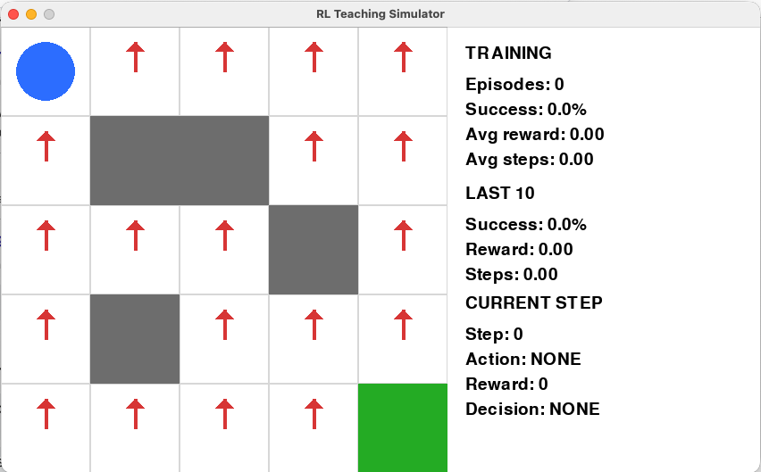
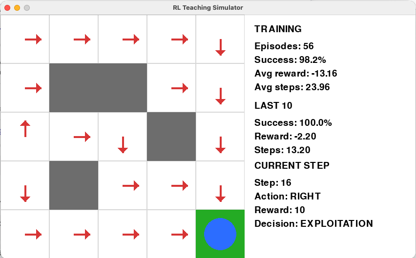

# RL Teaching Simulator 🧠

A visual, interactive simulator for learning the fundamental ideas behind
Reinforcement Learning.

The first project in this repository is a **GridWorld agent** that starts with
no knowledge of its environment and gradually learns how to reach its goal
through experience.

---

## From random decisions to a learned path

### Before training

At the beginning, the agent does not know where the goal is or which direction
it should take. Its decisions are based on initial, untrained value estimates.



### After training

After interacting with the environment over many episodes, the agent has learned
which actions are more valuable. The arrows show the learned policy—the
direction the agent has learned to take from each state.



The agent was never given a map or the correct path. It learned through trial,
error, rewards, and repeated updates to its estimates.

---

## How does the agent learn?

The learning process in this project is based on two closely related ideas:
the **Bellman equation** and the **Bellman update**.

The implementation can be found in:

`gridworld/src/rl/algorithms/q_learning.py`

## 1. The Bellman equation: What comes next matters

A decision is not valuable only because of the reward it gives immediately.
It can also be valuable because of where it leads.

The Bellman idea can be expressed as:

$$
Q(s, a) = r + \gamma \max_{a'} Q(s', a')
$$

In simple terms:

> **The value of a decision depends on the reward now and the best value that can come next.**

In the code, this idea appears when the agent calculates its learning target:

```python
target = reward + self.gamma * max_next_q
```

The agent combines:

- the **reward it received now**, and
- the **best value it expects from the next state**.

This allows an action to become valuable even when it does not immediately
produce the final reward. An action can be valuable because it leads the agent
toward another valuable state.

## 2. The Bellman update: Improving the value estimate

At the beginning, the agent does not know the true value of any action. It only
has an estimate based on what it has experienced so far.

After every new experience, it adjusts that estimate.

The Q-learning update is:


$$Q(s, a) \leftarrow Q(s, a) + \alpha \left[r + \gamma \max_{a'} Q(s', a') - Q(s, a)\right]$$

In simple terms, I find it helpful to think about the same idea as:

> **New value estimate = Old value estimate + Adjustment based on the current experience**

The adjustment is based on the difference between what the agent expected and
what it actually learned from the new experience.

In the Q-learning implementation, this appears as:

```python
error = target - current_q

new_q_value = (
    current_q
    + self.learning_rate * error
)
```

In simple terms:

> **Keep the old estimate, then move it slightly toward what the latest experience suggests.**

If the outcome is better than expected, the value estimate increases. If it is
worse than expected, the estimate decreases.

Over many experiences, these small adjustments gradually improve the agent's
understanding of which actions are likely to lead to better outcomes.

---

## The result

Together, these two ideas allow the agent to learn a path toward the goal:

- **The Bellman equation** helps the agent consider what might come next.
- **The Bellman update** helps the agent improve its value estimates based on experience.

The agent starts with no map and no knowledge of the correct path.

One experience at a time, it learns:

> **From where I am now, which action is most likely to lead me toward a better future?**

---

## Project structure

```text
RL-Teaching-Simulator/
│
├── README.md
├── assets/
│   ├── gridworld_before_training.png
│   └── gridworld_after_training.png
│
└── gridworld/
    └── src/
        └── rl/
            └── algorithms/
                └── q_learning.py
```

---

## Why this project?

Reinforcement Learning can sometimes feel highly mathematical and abstract.

This project was created to make those ideas easier to observe. Rather than
only reading about Q-values, rewards, exploration, and Bellman updates, the
goal is to see an agent start with no knowledge and gradually learn through
interaction with its environment.

More environments and reinforcement learning concepts will be added as the
project evolves.
